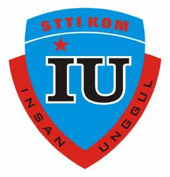

<!DOCTYPE html>
<html lang="id">
  <head>
    <meta charset="UTF-8" />
    <meta
      name="viewport"
      content="width=device-width, initial-scale=1.0"
    />
    <meta
      http-equiv="X-UA-Compatible"
      content="ie=edge"
    />
    <title>STTIKOM Insan Unggul</title>
    <link
      rel="stylesheet"
      href="style.css"
    />
  </head>
  <body>
    <header>
      

        
        <h1>STTIKOM Insan Unggul</h1>
        <nav>
          <ul>
            <li><a href="#">Beranda</a></li>
            <li><a href="#">Tentang</a></li>
            <li><a href="#">Program Studi</a></li>
            <li><a href="#">Kontak</a></li>
          </ul>
        </nav>
      

    </header>

    <section class="hero">
      

        <h2>Selamat datang di STTIKOM Insan Unggul</h2>
        
Tempat untuk mencetak generasi unggul di bidang Teknologi Informasi.

      

    </section>

    <section class="about">
      

        <h2>Tentang Kampus</h2>
        

          STTIKOM Insan Unggul Cilegon memiliki 4 program studi diantaranya Teknik Informatika (TI), Sistem Informasi (SI), Manajemen Informatika (MI) dan Komputer Akuntansi (KA).Sekolah Tinggi Teknologi Ilmu Komputer (STTIKOM) Insan Unggul
          berdiri sejak tahun 2003 berdasarkan keputusan Menteri Pendidikan Nasional Republik Indonesia No. 24/D/O/2003. Hal ini merupakan perwujudan kepedulian yayasan insan unggul terhadap pendidikan masyarakat, khususnya di wilayah
          Cilegon, Banten dan Sekitarnya.STTIKOM Insan Unggul memiliki komitmen untuk memadukan pengembangan kompetensi mahasiswa dengan materi program studi yang spesifik, agar para lulusan memperoleh posisi yang kuat di dunia kerja.
          Melalui pendekatan akademik dan professional, lulusan STTIKOM Insan Unggul Cilegon diharapkan mampu berperan aktif sebagai pelaku ekonomi dan teknologi di era global yang semakin terbuka dan kompetitif. Melalui bimbingan karir
          yang professional, mahasiswa dapat memanfaatkan keberadaan industri dalam penelitian dan pengembangan ilmu serta pengabdian pada masyarakat.
        

      

    </section>

    <section class="programs">
      

        <h2>Program Studi</h2>
        

          

            <h3>Teknik Informatika (TI)</h3>
            
Program studi yang mempelajari bidang komputer dan teknologi informasi.

          

          

            <h3>Sistem Informasi (SI)</h3>
            
Program studi yang berfokus pada manajemen informasi berbasis teknologi untuk mengelola dan menganalisis dalam konteks.

          

          

            <h3>Manajemen Informatika (MI)</h3>
            
Program yang bertujuan untuk memberikan pemahaman yang mendalam tentang konsep, teori, dan aplikasi.

        

        

            <h3>Komputerisasi Akuntansi (KA)</h3>
            
 program yang dirancang untuk pengetahuan mendalam dalam bidang akuntansi yang terintegrasi dengan teknologi komputer.

      

    </section>

    <section class="programs">
        

          <h2>Nama Dosen</h2>
          

            

              <h3>Achmad Syaefudin, ST, MM, M.Kom.</h3>
              
NIDN: 0422076301

            

            

              <h3>Bela Yusti Annasya, S. Pd., M. Pd.</h3>
              
NIDN: 0405069701

            

            

              <h3>Roy Amrullah Ritonga, M. Kom.</h3>
              
NIDN: 0423038304

          

          

              <h3>Teguh Sutopo, S.Kom, M.Kom.</h3>
              
 NIDN: 0429126501

        

        

              <h3>Wahyu Hidayatullah, S.Kom.</h3>
              
 NIDN: 9904200820	

        

      </section>

    <section class="contact">
      

        <h2>Kontak Kami</h2>
        
Email: info@sttikom-iu.ac.id

        
Telepon: (021) 123-4567

        

    </section>

        <!-- Menambahkan Google Maps -->
    <section class="contact">
      

        <h3>Lokasi Kampus</h3>
        

            <iframe src="https://www.google.com/maps/embed?pb=!1m18!1m12!1m3!1d3945.4290041130087!2d106.14492881503575!3d-6.010394995518106!2m3!1f0!2f0!3f0!3m2!1i1024!2i768!4f13.1!3m3!1m2!1s0x2e41999d32d7f71f%3A0x87d7980ffb6490ea!2sSTTIKOM%20Insan%20Unggul%20Cilegon!5e0!3m2!1sid!2sid!4v1674080519395!5m2!1sid!2sid" width="600" height="450" style="border:0;" allowfullscreen="" loading="lazy" referrerpolicy="no-referrer-when-downgrade"></iframe>

      

    </section>

    <footer>
      

        
&copy; 2025 STTIKOM Insan Unggul. Semua hak dilindungi.

      

    </footer>

    
  </body>
</html>
